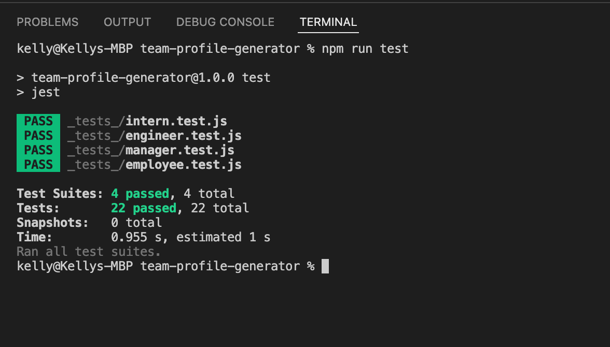

# Team Profile Generator
-------


## Table of Content

- [Description](#description)
- [Objectives](#objectives)
- [Installation](#installation)
- [Usage Information](#usage)
- [Images and Media](#media-and-images)
- [GitHub Repository](#github-repository)
- [Author](#author)  
- [Contributors](#contributors)
- [Technologies Used](#technologies-used) 
- [License](#license)

-------
## Description:  

The Team Profile Generator (TPG) is a Node.js command-line application that takes in information about employees on a software engineering team, then generates an HTML webpage that displays summaries for each person. Testing is key to making code maintainable, so the application contains the ability to perform a unit test for every part of the code and ensure that it passes each test.

-------

## Objectives:
```

- TPG is a command-line application that accepts user input to enter all data.
- When the manager starts the information, they will need to answer the default questions:
    * Name (default)
    * Employee ID (default)
    * Email Address (default)
    * Office Number (Manager question only)
- After answering the previous questions, the manager is given the option to
    * Add an Engineer
    * Add an Intern
    * Finish Building Team
- Selecting Engineer will require all the original default questions plus this additional:
    * GitHub username (Engineer only)
- Selecting Intern will require the default questions plus this additional
    * School name (Intern only)
- Selecting Finish Building Team
    * Will push all data and generate a HTML and exit application
    
```
-----
## Installation

1. Clone the TPG repository off of GitHub. (Link to this repository is below)
2. Install dependencies needed for this application:
    1. right click on the team-profile-generator folder within VS Code and select 'Open in Integrated Terminal'
    2. enter 'npm install'
        - To confirm the install was successful, enter npm test and wait for the testing to complete.  Green means you're good to proceed.

-----
## Usage:

1. Start the integrated terminal within the app folder and enter 'node index.js' and press enter.
2. Follow all the prompts.
3. Once you are finished, you will find the generated HTML file within the 'dist' folder.

-----
## Media and Images:


Test Results:


Generated HTML:


Video of Team Profile Generator:

- [Media of Team Profile Generator Usage](https://drive.google.com/file/d/1EvyRkrwOL09PZM50CGVi4cttF49KwdkU/view?usp=sharing)


----

## Github Repository:

- [Github Repository for Team Profile Generator](https://github.com/ksjefferies/team-profile-generator)

## Author:

- [Kelly Jefferies](https://github.com/ksjefferies)

## Contributors

- Eugene Ahn
- Daniel Norred

## Technologies Used:
- Javascript
- HTML / CSS
- Bootstrap
- Node
- [Inquirer](https://www.npmjs.com/package/inquirer)
- [Jest](https://jestjs.io/)

## License:

[](http://choosealicense.com/licenses/mit/)
